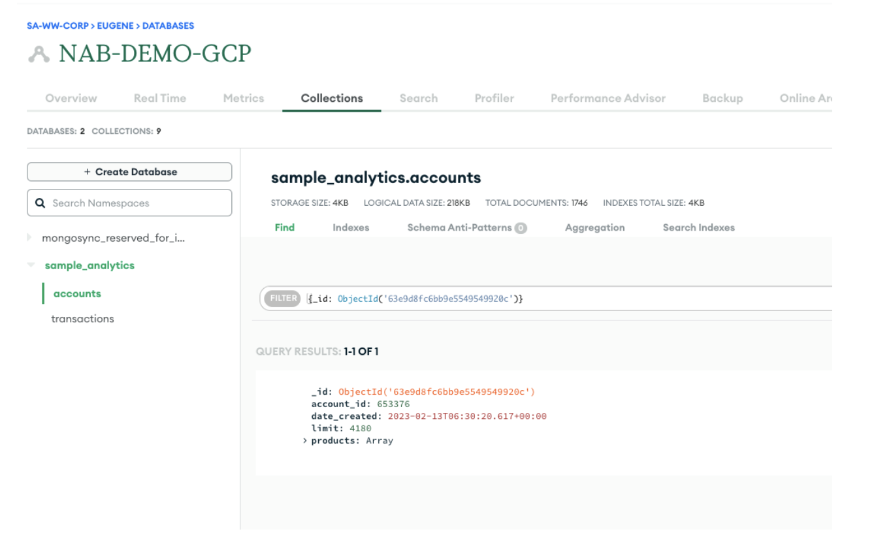

# CLUSTER TO CLUSTER SYNC

**Ability to achieve stressed exits from 1 cluster to another as part of multi-cluster DR strategy**

**SA Maintainer**: [Eugene Tan](mailto:eugene.tan@mongodb.com) <br/>
**Time to setup**: 10 mins <br/>
**Time to execute**: 15 mins <br/>

---

## Description

This proof shows how you can achieve a stressed exit from one MongoDB cluster to another by achieving an active-passive multi cluster DR strategy.

For this proof, an Atlas cluster will be loaded with [sample data](https://docs.atlas.mongodb.com/sample-data/). The **accounts** and **transactions** collection in the **sample_analytics** database will be written to by the application to simulate a live replication of data from the source to target cluster. This proof shows that data can be migrated and kept in realtime sync between source and target Atlas clusters as part of the cluster to cluster sync as part of a DR strategy. This proof also showcases you can also run a filtered sync to only sync a subset of collections ( **transactions** ) to the target cluster.

---

## Setup

**1. Configure Atlas Environment**

- **Note**: If using the Shared Demo Environment (https://docs.google.com/document/d/1cWyqMbJ_cQP3j7S4FJQhjRRiKq9WPfwPG6BmJL2bMvY/edit), please refer to the pre-existing collections for this PoV. (RICH-QUERY.customers & RICH-QUERY.customersIndexed)
- Log-on to your [Atlas account](http://cloud.mongodb.com) (using the MongoDB SA preallocated Atlas credits system) and navigate to your SA project
- In the project's Security tab, choose to add a new user, configure database user “ADMIN” with role “Atlas Admin”
- In the Security tab, add a new **IP Whitelist** for your laptop's current IP address
- Create an **M10** based 3 node replica-set in **AWS**, running on version 6.0 and name it **DEMO-AWS** in **SYD** region
- Create an **M10** based 3 node replica-set in **GCP**, running on version 6.0 and name it **DEMO-GCP** in **MELBOURNE** region
- In the Atlas console, for the database cluster you deployed, click the **Connect button**, select **Connect Your Application**, and for the **latest Node.js version** copy the **Connection String Only** - make a note of this MongoDB URL address to be used in the next step for both clusters created

**2. Load Data Into A Collection In The Atlas Cluster**

- Load sample data set with the Atlas UI and verify that the data is loaded in the Atlas Data Explorer

**3. Install mongosync**

- Install via the [Download Center](https://www.mongodb.com/docs/cluster-to-cluster-sync/current/installation/) and choose the correct OS your local machine runs on

**4. Run Mongosync**

- Once mongosync is installed, run mongosync with this command:

```bash
mongosync \
  --cluster0 'mongodb+srv://ADMIN:<password>@<demo-aws cluster connection string>/' \
  --cluster1 'mongodb+srv://ADMIN:<password>@<demo-gcp cluster connection string>/'
```

**5. Ensure mongosync is running at localhost:27182**

- Mongosync in the CLI should have a message like so:

```bash
{"level": "info", ... , "message": "running webserver"}
```

---

## Execution

**1. Run The Test Query to ascertain a record exists in source cluster**

- Verify the count on both the **Accounts collection** and the **Transactions collection** in the **Sample_Analytics database** are as below:
  
  

- Note the number of documents returned - 1746 in this example. It's also important to highlight that the client application was not involved in processing the query

- In the Atlas UI **Data Explorer** tab, enter the following query filter on both the accounts and transactions collections in the sample_analytics database:
  ```
  FILTER: {account_id: 371138}
  ```
- Clicking the **FIND** button returns the matching document in both the accounts and transactions collections.

**2. Run filtered sync on Mongosync**

- Go to postman or any other api explorer tool and fire a /POST command to the endpoint localhost:27182/api/v1/start with the body payload below
  ```
  {
    "source": "cluster0",
    "destination": "cluster1",
    "includeNamespaces" : [
        {
            "database" : "sample_analytics",
            "collections": [ "accounts", "transactions" ]
        }
    ]
  }
  ```
- You should get a "success" message like below:
  

**3. Ensure all documents are replicated from DEMO-AWS cluster to DEMO-GCP cluster**

- In the **Atlas Data Explorer** tab, check that the number of documents in DEMO-AWS cluster for both the accounts and transactions collections are the same in the DEMO-GCP cluster in both the sample_analytics.accounts and transactions collection.


**4. Find {account_id: 371138} on “DEMO-GCP” cluster**

- Find {account_id: 371138} on “DEMO-GCP” cluster in both the sample_analytics.accounts / sample_analytics.transactions collection
  
  

**4. Run app-insert script in the root folder that connects to “DEMO-AWS” cluster**


**4. Take the first account id and transaction id inserted and verify it exists in “DEMO-AWS” cluster in both the sample_analytics.accounts / sample_analytics.transactions collections**


**5. Verify that the same document ids for sample_analytics.accounts and sample_analytics.transactions were replicated to “DEMO-GCP” cluster**



